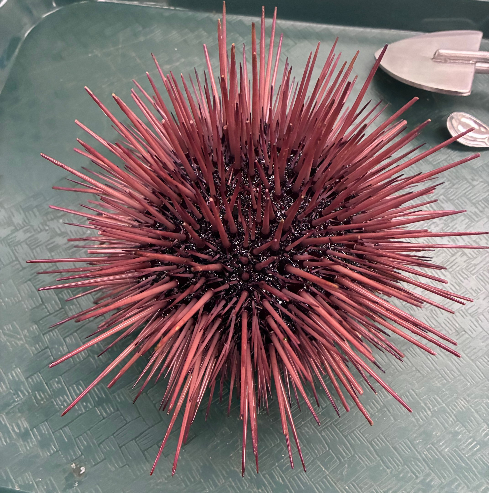
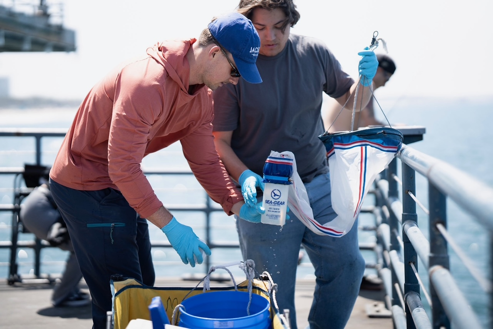
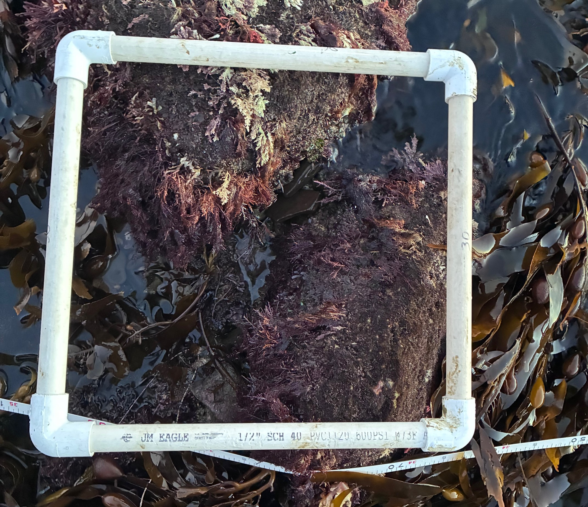
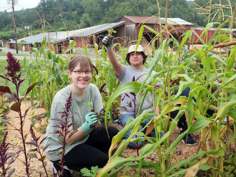

## Watershed Influences

::::: columns
::: {.column width="50%"}
My last year at CPP I had the opportunity to work in the [Bonisoli Alquati Lab](https://www.bonisolialquatilab.com/), where I aided with urchin and mussel dissections as part of a larger project that aimed to quantify pesticide concentrations in purple urchins (*Strongylocentrotus purpuratus*) and red urchins (*Mesocentrotus franciscanus*) between the Santa Clara and LA river watersheds. I determined how mussel (*Mytilus californianus*) health and giant kelp (*Macrocystis pyrifera*) distribution differed between these two sites as part of my senior project.
:::

::: {.column width="50%"}
{fig-align="center" width="482"}
:::
:::::

## Panama

::::: columns
::: {.column width="40%"}
This Spring I had the opportunity to take part in the BIO 4550/L field biology course at CPP. Lead by Dr. Claisse and Dr. Valdez, myself and 15 other students were able to develop our own research project based in Bocas del Toro, Panama (Stationed at [ITEC](https://itec-edu.org/)). I flipped upside-down sea jellies (*Cassipea xamachana*, *C. frondosa*) alongside 2 other peers, determining site differences and looking for the parasitic nudibranch *Dondice pargeurensis* to determine host preference between the 2 species. This trip enhanced my in-water sampling techniques and ability to withstand sea jelly stings for longer than needed periods of time.
:::

::: {.column width="60%"}
{fig-align="center"}
:::
:::::

## Harmful Algal Blooms & Wildfire

::::: columns
::: {.column width="40%"}
In the Summer of 2025 I was able to participate in the USC Wrigley Institute REU in Coastal Ocean Processes. Working under my mentor Bradley Mackett I investigated how ash and PHOS-CHEK from the Palisades wildfire influenced the growth rates and domoic acid production of *Pseudo-nitzchia.* Details about the project can be found in my blog post [here](https://dornsife.usc.edu/wrigley/2025/11/18/tracing-the-connection-between-wildfires-harmful-algal-blooms/)!
:::

::: {.column width="60%"}
{fig-align="center" width="502"}
:::
:::::

## Coastal Ecology

::::: columns
::: {.column width="50%"}
From spring 2025 - spring 2026 I had the opportunity to participate in field work as part of Dr. Smith's [Coastal Ecology Lab](https://www.instagram.com/smithlab_cpp/) at CPP. Here I aided graduate students with various projects from line transects to feeding experiments. I also had the opportunity to help members a part of the Multi-Agency Rocky Intertidal Network (MARINe) as part of their yearly biodiversity surveys in Southern California
:::

::: {.column width="50%"}

:::
:::::

## Pathways to STEM

::::: columns
::: {.column width="45%"}
From June 2023 to August 2024, I participated as part of an experiential learning program, Pathways to STEM, while I attended community college. This program took my peers and I to different research sites including the Oak Crest institute of Science, Wrigley Marine Science Center, NASA JPL, CU Boulder, and Marlboro, Vermont. Each site was themed around different aspects in biology, and it where I developed my passion for ecology and ecosystem health.
:::

::: {.column width="55%"}
{fig-align="center"}
:::
:::::
