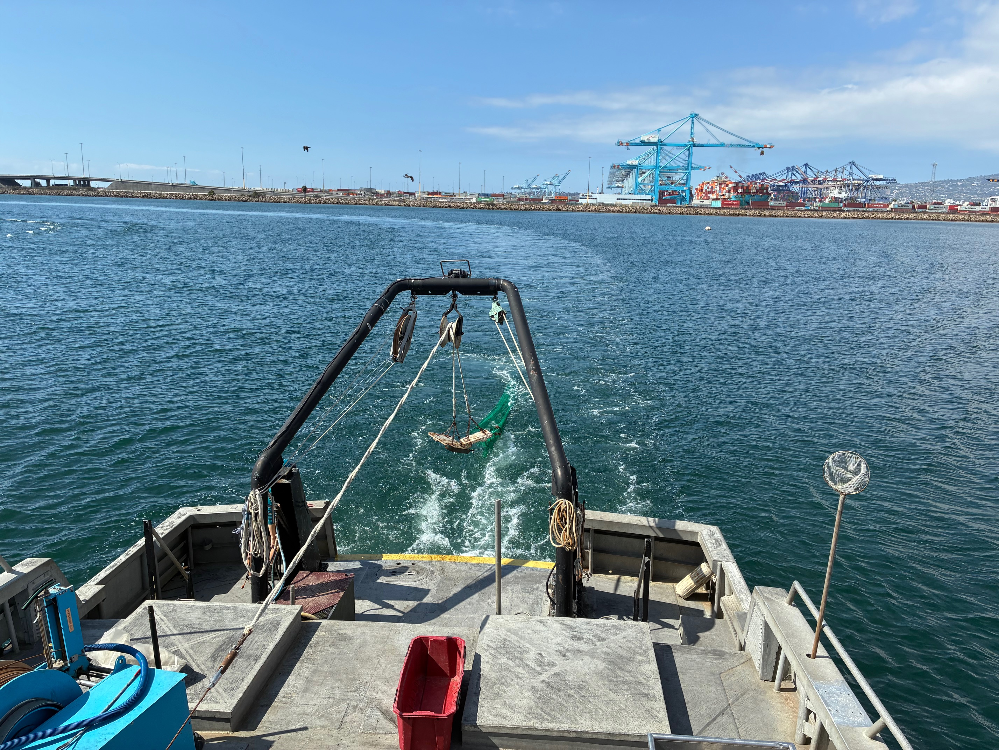

Hello! I am Brandon Koehn, a recent graduate in Environmental Biology from Cal Poly Pomona

My research focuses on understanding how natural and anthropogenic stressers impact marine ecosystems through both fieldwork and laboratory analysis. I will be applying to graduate school this Fall, and hopefully continue to study how pollutants influence our coasts.

**Education**

California State Polytechnic University, Pomona \| Bachelor of Science in Environmental Biology \| Pomona, CA \| August 2024 - May 2026

Citrus College \| Associate of Science \| Wildland Resources & Forestry \| Biology \| Glendora, CA \| January 2022 - June 2024

{fig-align="center"}
